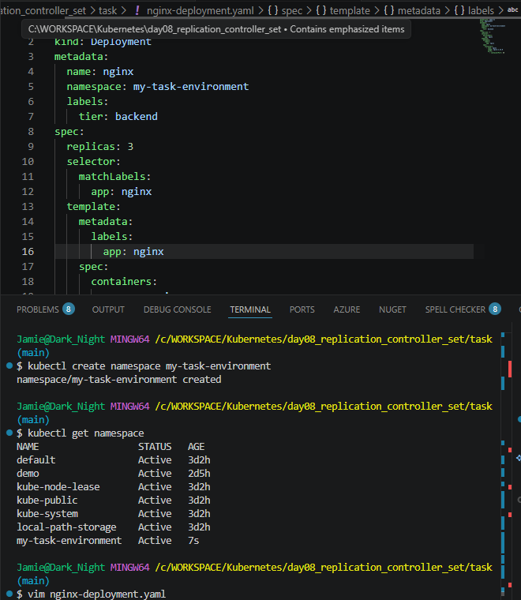
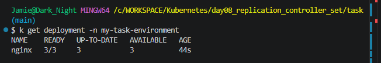
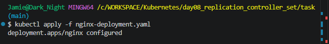
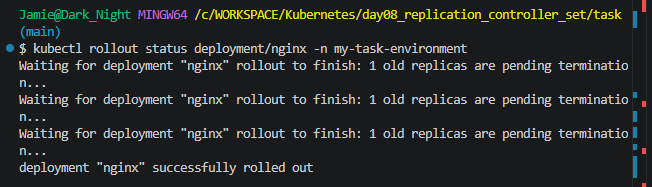
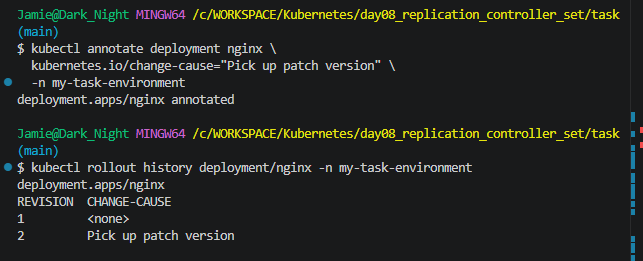
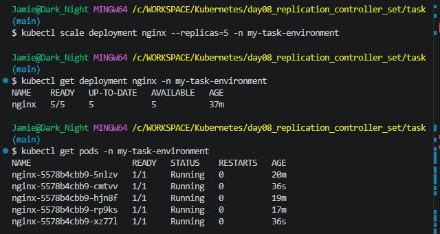
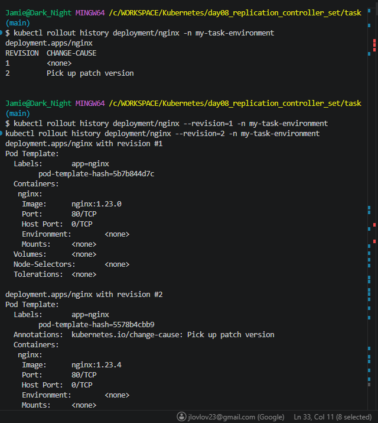
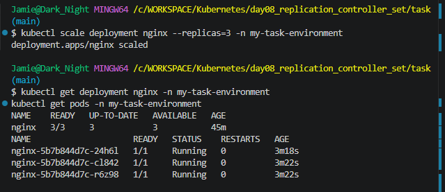

## Home Work😣
1. Create a Deployment named `nginx` with 3 replicas. The Pods should use the `nginx:1.23.0` image and the name `nginx`. The Deployment uses the label `tier=backend`. The Pod template should use the label `app=v1`.
* I created a custom namespace called ```my-task-environment``` and create the deployment in there👇🏾



1. List the Deployment and ensure the correct number of replicas is running.
* 



1. Update the image to `nginx:1.23.4`.
* I updated manifest in the YAML file then applied the changes to the environment.



1. Verify that the change has been rolled out to all replicas.
* 



1. Assign the change cause "Pick up patch version" to the revision.
* 



1. Scale the Deployment to 5 replicas.
* I used imperative commands to scale replicas to 5 running pods. This allowed me to keep the manifest in tack.



1. Have a look at the Deployment rollout history.
* 



1. Revert the Deployment to revision 1.
* The cluster is currently showing 5 replicas. To scale it back to 3 you have to scale the replicas ```request/command``` down to ```0```



1. Ensure that the Pods use the image `nginx:1.23.0`.
* I made it permanent in the manifest, by updating the YAML 