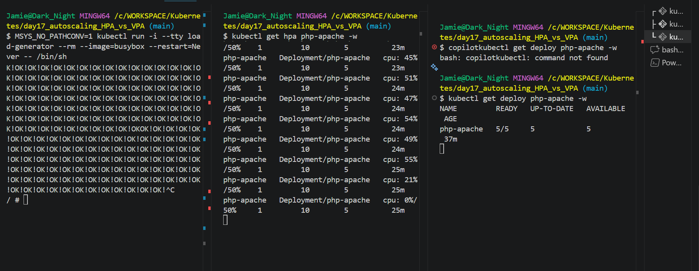

# Kubernetes Autoscaling (HPA) - Build, Create, and Check




This guide shows the fastest practical flow to set up and validate **Horizontal Pod Autoscaler (HPA)** for the `php-apache` app.

## 1) Prerequisites (do this first)

HPA based on CPU requires:
- A running metrics pipeline (`metrics-server`)
- CPU requests set on the container

Verify metrics:

```bash
kubectl top nodes
kubectl top pods -A
```

If this fails, install metrics-server first (from previous day):

```bash
kubectl apply -f ../day16_requests_and_limits/metrics-server.yaml --validate=false
kubectl get apiservice v1beta1.metrics.k8s.io -o wide
```

`Available=True` means metrics API is healthy.

## 2) Build the app workload (Deployment + Service)

Create the workload from `deploy.yaml`:

```bash
kubectl apply -f deploy.yaml
kubectl get deploy,svc,pods -l run=php-apache
```

Your Deployment already has CPU request/limit:

```yaml
resources:
	limits:
		cpu: 500m
	requests:
		cpu: 200m
```

This is required so HPA can calculate CPU utilization percent.

## 3) Create autoscaling (HPA)

Use the current command syntax (non-deprecated):

```bash
kubectl autoscale deployment php-apache --cpu=50% --min=1 --max=10
```

What this means:
- Target average CPU utilization: `50%` of requested CPU
- Minimum replicas: `1`
- Maximum replicas: `10`

## 4) Check autoscaling status

Basic checks:

```bash
kubectl get hpa php-apache -o wide
kubectl describe hpa php-apache
kubectl get deploy php-apache
```

Look for:
- Metrics line with current/target CPU (for example `0% / 50%`)
- Conditions such as `ScalingActive=True`
- Replica changes in the Deployment over time

## 5) Trigger a scale-up test (important for practice)

Run a temporary load pod:

Git Bash note: prevent MSYS path conversion for `/bin/sh`.

```bash
MSYS_NO_PATHCONV=1 kubectl run -i --tty load-generator --rm --image=busybox --restart=Never -- /bin/sh
```

PowerShell/CMD alternative:

```bash
kubectl run -i --tty load-generator --rm --image=busybox --restart=Never -- sh
```

Inside that shell:

```sh
while true; do wget -q -O- http://php-apache; done
```

In another terminal, watch scaling:

```bash
kubectl get hpa php-apache -w
kubectl get deploy php-apache -w
```

Stop the load (`Ctrl+C` in load shell) and observe scale-down after stabilization.

## 6) Useful troubleshooting

1. `unknown flag: --cpu-percent`:
- Use `--cpu=50%` instead of `--cpu-percent=50`.

2. HPA exists but no metrics:
- Check `kubectl top nodes`
- Check APIService status:

```bash
kubectl get apiservice v1beta1.metrics.k8s.io -o wide
```

3. HPA not scaling:
- Confirm load is actually hitting the service.
- Confirm pod requests include CPU.
- Inspect HPA events:

```bash
kubectl describe hpa php-apache
```

## 7) Cleanup commands

```bash
kubectl delete hpa php-apache --ignore-not-found
kubectl delete -f deploy.yaml --ignore-not-found
kubectl delete pod load-generator --ignore-not-found
```

## 8) CKA quick recap

- HPA uses utilization relative to **requests**, not limits.
- If metrics pipeline is down, HPA cannot make decisions.
- Use `kubectl get hpa` and `kubectl describe hpa` for exam-time debugging.
