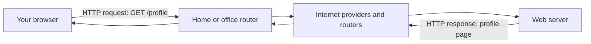
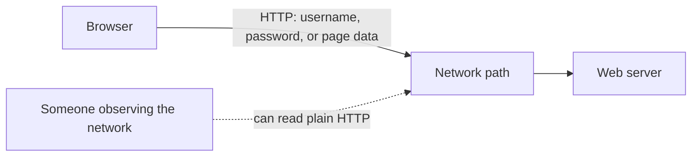
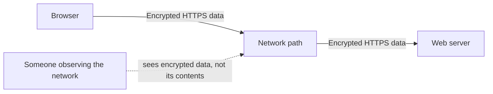
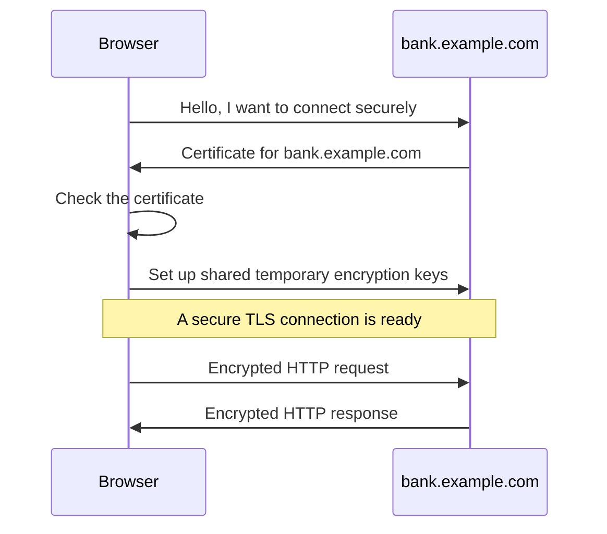
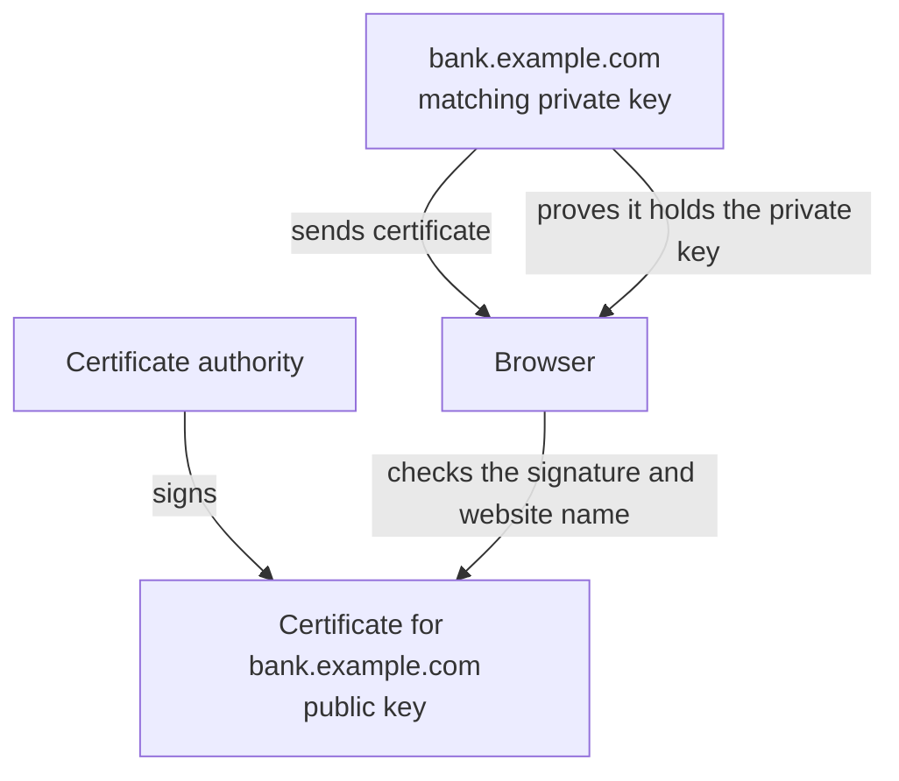
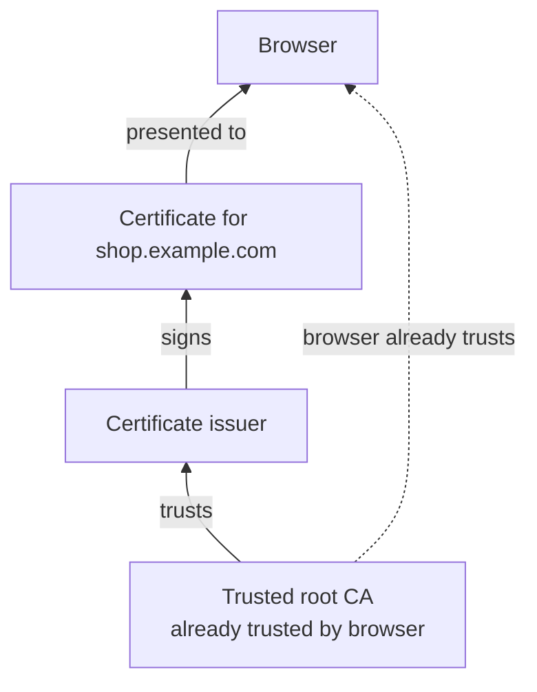
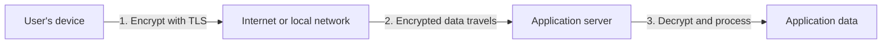
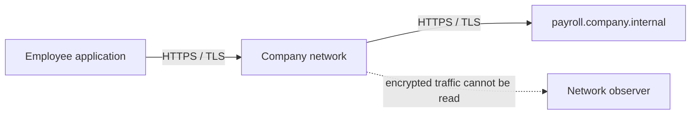
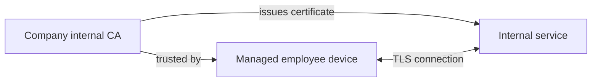

# SSL, TLS, and Certificates

When one computer sends data to another, that data travels through several networks and devices before reaching its destination. SSL and TLS help keep that data private and prove that it reached the right server.

> **TLS** means Transport Layer Security. It is the modern security protocol used by HTTPS. **SSL** is its older predecessor. People still commonly say "SSL certificate," but modern websites use TLS.

## A simple HTTP request

HTTP is the language used by a browser and a web server to request and return web pages, APIs, images, and other data.

For example, entering `http://example.com/profile` tells a browser to request the `/profile` page from `example.com`.

HTTP by itself does **not** encrypt the request or response. A person who can observe the connection at a public Wi-Fi hotspot, on a network, or at another point between the browser and server may be able to read or change the data.

This is why login pages, payments, private APIs, and everyday web applications should use HTTPS.

## HTTPS: HTTP protected by TLS

HTTPS is simply HTTP sent through a TLS-protected connection.

TLS provides three important protections:

- **Privacy:** people in the middle cannot read the application data.
- **Integrity:** changes made while the data travels are detected.
- **Identity:** the browser can check that it connected to the intended website.

The network still carries the packets and can usually see the destination domain or IP address, but it cannot read the protected HTTP request and response.

## What happens when you open an HTTPS website

Suppose you visit `https://bank.example.com`.

1. The browser connects to the server.
2. The server sends its TLS certificate.
3. The browser checks the certificate and its identity.
4. The browser and server create temporary encryption keys.
5. The browser sends encrypted HTTP requests and receives encrypted HTTP responses.

The certificate check happens before sensitive page data is sent. If the certificate is expired, belongs to another name, or is not trusted, the browser shows a warning instead of quietly trusting the site.

## What is a certificate?

A certificate is like a signed identity card for a server. It says, "this public key belongs to `bank.example.com`."

It includes:

- The domain name or names it is valid for.
- A **public key**, which clients can safely receive.
- Start and expiry dates.
- The name and signature of the organization that issued it.

The server also has a matching **private key**. That key stays secret on the server. The server uses it to prove that the certificate really belongs to it.

## Why browsers trust certificates

Browsers and operating systems contain a list of trusted certificate authorities, often called **CAs**. A CA verifies that an organization controls a domain before issuing a certificate for it.

When a browser receives a website certificate, it checks that the certificate leads back to a trusted CA and that the requested website name matches.

This process helps prevent an attacker from presenting a random certificate and pretending to be `shop.example.com`.

## Protecting data from point to point

TLS protects data **in transit**: while it moves between a client and server. At each endpoint, the application decrypts the data so it can use it.

TLS is essential, but it does not protect everything by itself. Applications must also use strong authentication, authorization, secure storage, software updates, and careful handling of decrypted data.

## TLS on a company intranet

TLS is useful inside a company too. An internal network can include shared Wi-Fi, employee devices, contractors, compromised computers, and many separate systems. Internal traffic should not automatically be treated as safe.

For example, an employee application might securely call an internal payroll service:

Companies often run their own internal certificate authority. Company-managed devices are configured to trust that internal CA, allowing internal service names such as `payroll.company.internal` to use TLS certificates.

The same idea can secure communication between internal services, virtual machines, containers, and Kubernetes workloads.

## Practical rules

- Use `https://` for websites and APIs that send or receive meaningful data.
- Never ignore browser certificate warnings for a real service without understanding why they appeared.
- Keep the server's private key private. Do not commit it to Git or send it in chat or email.
- Renew certificates before they expire.
- Use TLS both on the public internet and for sensitive internal connections.
- Remember: TLS protects data while it travels. Protect the devices and servers at both ends too.

## Quick vocabulary

| Term | Meaning |
| --- | --- |
| HTTP | Plain web request and response protocol. |
| HTTPS | HTTP carried through a TLS-encrypted connection. |
| SSL | Old security protocol name; the term is still used informally. |
| TLS | Modern protocol that encrypts and authenticates network connections. |
| Certificate | Signed information that identifies a server and contains its public key. |
| Public key | Information that can be shared with clients. |
| Private key | Secret information held by the server; it must be protected. |
| Certificate authority (CA) | A trusted organization that signs certificates. |
